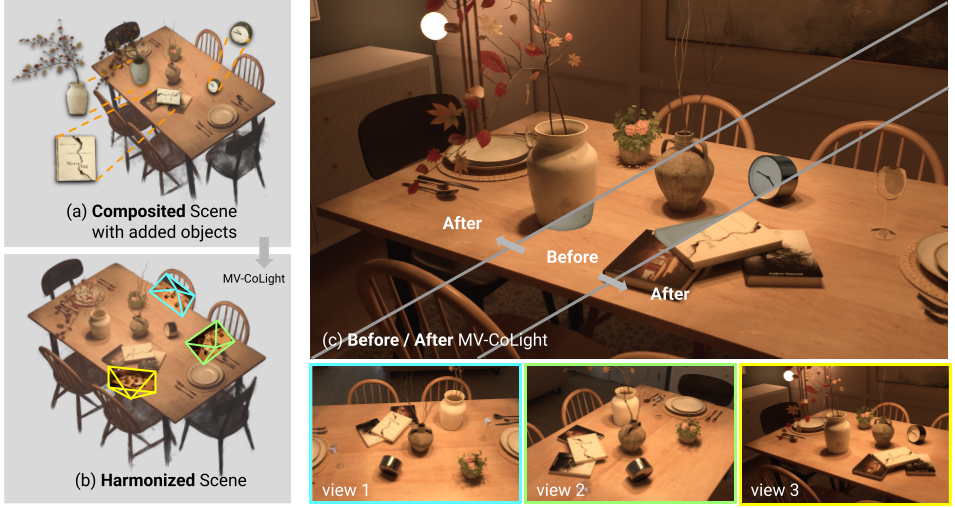
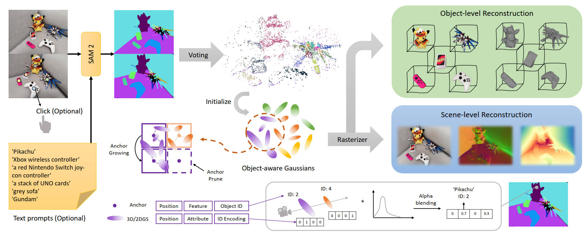
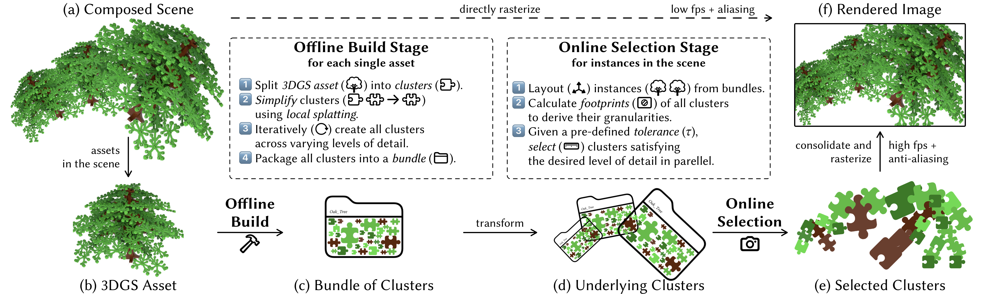
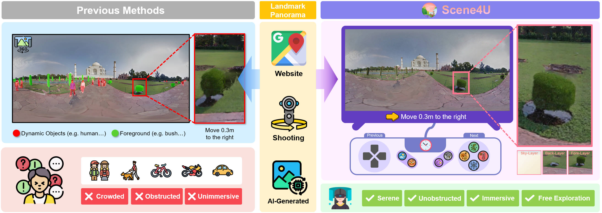
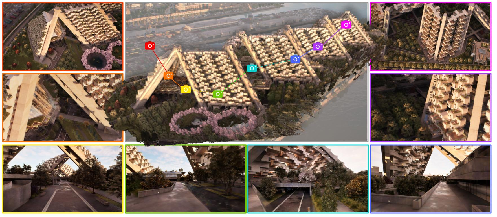
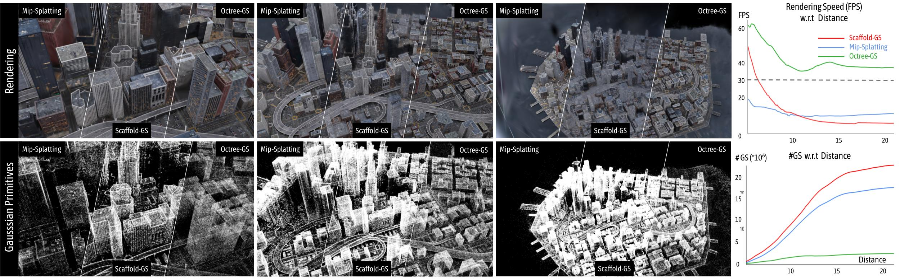
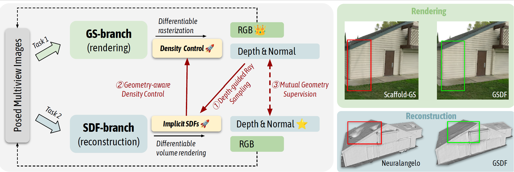








I am currently a second-year Ph.D. student at [USTC](https://www.ustc.edu.cn/) and [Shanghai AI Laboratory](https://www.shlab.org.cn/). I am co-supervised by [Feng Zhao](https://en.auto.ustc.edu.cn/2021/0616/c26828a513169/page.htm), [Bo Dai](https://daibo.info/), and [Dahua Lin](http://dahua.site/). Previously, I obtained my B.Eng. degree at [SGG](http://main.sgg.whu.edu.cn/) of Wuhan University in 2023. 

My research interest lies in the field of 3D Computer Vision, particularly neural rendering for large-scale scenes and feed-forward reconstruction.

# 🔥 News
- 2025.09: 🎉 one paper got accepted to [NeurIPS 2025](https://neurips.cc/Conferences/2025/). 
- 2025.08: 🎉 one paper got accepted to [SIGGRAPH Asia 2025 (ACM TOG)](https://asia.siggraph.org/2025/). 
- 2025.06: 🎉 one paper got accepted to [ICCV 2025](https://iccv.thecvf.com/Conferences/2025). 
- 2025.05: 🎉 one paper got accepted to [SIGGRAPH 2025](https://s2025.siggraph.org/). 
- 2025.05: 🎉 one paper got accepted to [TPAMI 2025](https://ieeexplore.ieee.org/xpl/RecentIssue.jsp?punumber=34). 
- 2025.02: 🎉 two papers got accepted to [CVPR 2025](https://cvpr.thecvf.com/Conferences/2025). 
- 2024.09: 🎉 one paper got accepted to [NeurIPS 2024](https://neurips.cc/Conferences/2024). 
- 2023.09: 🎉 one paper got accepted to [NeurIPS 2023 D&B Track](https://nips.cc/Conferences/2023/CallForDatasetsBenchmarks). 
- 2023.07: 🎉 our [LandMark System](https://landmark.intern-ai.org.cn/) was released.
- *2023.07*: 🎉 one paper got accepted to [ICCV 2023](https://iccv2023.thecvf.com/). 
- 2023.06: 🎓 Graduated from Wuhan University.

# 📝 Publications 

(†: corresponding author; * :equal contribution)

<!-- AnySplat -->

SIGGRAPH Asia 2025 (ACM TOG)

**AnySplat: Feed-forward 3D Gaussian Splatting from Unconstrained Views**

**Lihan Jiang\***,
[Yucheng Mao*](https://myc634.github.io/yuchengmao/),
[Linning Xu](https://eveneveno.github.io/lnxu),
[Tao Lu](https://inspirelt.github.io/),
[Kerui Ren](https://cskrren.github.io/),
[Yichen Jin](),
[Xudong Xu](https://scholar.google.com.hk/citations?user=D8VMkA8AAAAJ&hl=en),
[Mulin Yu](https://scholar.google.com/citations?user=w0Od3hQAAAAJ),
[Jiangmiao Pang](https://oceanpang.github.io/)
[Feng Zhao](https://scholar.google.co.uk/citations?user=r6CvuOUAAAAJ&hl=en),
[Dahua Lin](http://dahua.site/),
[Bo Dai†](https://daibo.info/)

[[**Project**]](https://city-super.github.io/anysplat/)&nbsp;
[[**Paper**]](https://arxiv.org/pdf/2505.23716)&nbsp;
[[**Code**]](https://github.com/OpenRobotLab/AnySplat)

<!-- AnySplat -->

<!-- MVColight -->

NeurIPS 2025

**MV-CoLight: Efficient Object Compositing with Consistent Lighting and Shadow Generation**

[Kerui Ren](https://cskrren.github.io/),
[Jiayang Bai](https://scholar.google.com/citations?user=VmPQ6akAAAAJ&hl=zh-CN),
[Linning Xu](https://eveneveno.github.io/lnxu),
**Lihan Jiang**,
[Jiangmiao Pang](https://oceanpang.github.io/)
[Mulin Yu†](https://scholar.google.com/citations?user=w0Od3hQAAAAJ),
[Bo Dai†](https://daibo.info/)

[[**Project**]](https://city-super.github.io/mvcolight/)&nbsp;
[[**Paper**]](https://arxiv.org/pdf/2505.21483v1)&nbsp;
[[**Code**]]()

<!-- MVColight -->

<!-- ObjectGS -->

ICCV 2025

**ObjectGS: Object-aware Scene Reconstruction and Scene Understanding via Gaussian Splatting**

[Ruijie Zhu](https://ruijiezhu94.github.io/ruijiezhu/),
[Mulin Yu](https://scholar.google.com/citations?user=w0Od3hQAAAAJ),
[Linning Xu](https://eveneveno.github.io/lnxu),
**Lihan Jiang**,
[Yixuan Li](https://yixuanli98.github.io/),
[Tianzhu Zhang](https://staff.ustc.edu.cn/~tzzhang/),
[Jiangmiao Pang](https://oceanpang.github.io/), 
[Bo Dai†](https://daibo.info/), 

[[**Project**]](https://ruijiezhu94.github.io/ObjectGS_page/)&nbsp;
[[**Paper**]](https://arxiv.org/pdf/2507.15454.pdf)&nbsp;
[[**Code**]](https://github.com/RuijieZhu94/ObjectGS)

<!-- ObjectGS -->

<!-- V3DG -->

SIGGRAPH 2025

**Virtualized 3D Gaussians: Flexible Cluster-based Level-of-Detail System for Real-Time Rendering of Composed Scenes**

[Xijie Yang](https://yang-xijie.github.io/),
[Linning Xu](https://eveneveno.github.io/lnxu),
**Lihan Jiang**,
[Dahua Lin](http://dahua.site/), 
[Bo Dai†](https://daibo.info/), 

[[**Project**]](https://xijie-yang.github.io/V3DG/)&nbsp;
[[**Paper**]](https://arxiv.org/pdf/2505.06523)&nbsp;
[[**Code**]](https://github.com/city-super/V3DG)

<!-- V3DG -->

<!-- Scene4U -->

CVPR 2025

**Scene4U: Hierarchical Layered 3D Scene Reconstruction from Single Panoramic Image for Your Immerse Exploration**

[Zilong Huang](https://openreview.net/profile?id=~Zilong_Huang2),
[Jun He](https://scholar.google.com/citations?user=ktFT40UAAAAJ&hl=zh-CN),
[Junyan Ye](https://scholar.google.com/citations?user=6IbGkd4AAAAJ&hl=en), 
**Lihan Jiang**,
[Weijia Li](https://liweijia.github.io/), 
[Yiping Chen](https://scholar.google.com/citations?user=e9lv2fUAAAAJ&hl=en), 
[Ting Han](https://scholar.google.com/citations?user=IVWx-jwAAAAJ&hl=zh-CN)

[[**Project**]]()&nbsp;
[[**Paper**]](https://arxiv.org/pdf/2504.00387)&nbsp;
[[**Code**]]()

<!-- Scene4U -->

<!-- Horizon-GS -->

CVPR 2025

**Horizon-GS: Unified 3D Gaussian Splatting for Large-Scale Aerial-to-Ground Scenes**

**Lihan Jiang\***,
[Kerui Ren*](https://cskrren.github.io/),
[Mulin Yu](https://scholar.google.com/citations?user=w0Od3hQAAAAJ),
[Linning Xu](https://eveneveno.github.io/lnxu),
[Junting Dong](https://jtdong.com/),
[Tao Lu](https://inspirelt.github.io/),
[Feng Zhao](https://scholar.google.co.uk/citations?user=r6CvuOUAAAAJ&hl=en),
[Dahua Lin](http://dahua.site/),
[Bo Dai†](https://daibo.info/)

[[**Project**]](https://city-super.github.io/horizon-gs/)&nbsp;
[[**Paper**]](https://arxiv.org/pdf/2412.01745)&nbsp;
[[**Code**]](https://github.com/OpenRobotLab/HorizonGS)

<!-- Horizon-GS -->

<!-- Octree-GS -->

TPAMI 2025

**Octree-GS: Towards Consistent Real-time Rendering with LOD-Structured 3D Gaussians**

[Kerui Ren*](https://cskrren.github.io/),
**Lihan Jiang\***,
[Tao Lu](https://inspirelt.github.io/),
[Mulin Yu](https://scholar.google.com/citations?user=w0Od3hQAAAAJ),
[Linning Xu](https://eveneveno.github.io/lnxu),
[Zhangkai Ni](https://eezkni.github.io/),
[Bo Dai†](https://daibo.info/)

[[**Project**]](https://city-super.github.io/octree-gs/)&nbsp;
[[**Paper**]](https://arxiv.org/abs/2403.17898)&nbsp;
[[**Code**]](https://github.com/city-super/Octree-GS)

<!-- Octree-GS -->

<!-- GSDF -->

NeurIPS 2024

**GSDF: 3DGS Meets SDF for Improved Rendering and Reconstruction**

[Mulin Yu\*](https://scholar.google.com/citations?user=w0Od3hQAAAAJ),
[Tao Lu*](https://inspirelt.github.io/),
[Linning Xu](https://eveneveno.github.io/lnxu),
**Lihan Jiang**,
[Yuanbo Xiangli†](https://kam1107.github.io/),
[Bo Dai](https://daibo.info/)

[[**Project**]](https://city-super.github.io/GSDF/)&nbsp;
[[**Paper**]](https://arxiv.org/abs/2403.16964)&nbsp;
[[**Code**]](https://github.com/city-super/GSDF)

<!-- GSDF -->

<!-- PAD -->

NeurIPS 2023 D&B Track 

**PAD: A Dataset and Benchmark for Pose-agnostic Anomaly Detection**

[Qiang Zhou\*](https://scholar.google.com/citations?user=CMYTxUEAAAAJ&hl=en),
[Weize Li\*](https://ericlee0224.github.io/),
**Lihan Jiang**,
[Guoliang Wang](https://github.com/Cross-ZBuild),
[Guyue Zhou](https://air.tsinghua.edu.cn/en/info/1046/1196.htm),
[Shanghang Zhang](https://www.shanghangzhang.com/),
[Hao Zhao†](https://sites.google.com/view/fromandto)

[[**Project**]](https://github.com/EricLee0224/PAD)&nbsp;
[[**Paper**]](https://arxiv.org/pdf/2310.07716.pdf)&nbsp;
[[**Code**]](https://github.com/EricLee0224/PAD)

<!-- PAD -->

<!-- MatrixCity -->

ICCV 2023

**MatrixCity: A Large-scale City Dataset for City-scale Neural Rendering and Beyond** 

[Yixuan Li*](https://yixuanli98.github.io/),
**Lihan Jiang\***,
[Linning Xu](https://eveneveno.github.io/lnxu/),
[Yuanbo Xiangli](https://kam1107.github.io/),
[Zhengzhi Wang](https://zhenzhiwang.github.io/),
[Dahua Lin](http://dahua.me/),
[Bo Dai†](http://daibo.info/)

[[**Project**]](https://city-super.github.io/matrixcity/)&nbsp;
[[**Paper**]](https://arxiv.org/pdf/2309.16553v1.pdf)&nbsp;
[[**Code**]](https://github.com/city-super/MatrixCity)

<!-- MatrixCity -->

# 🎖 Honors and Awards
- Outstanding Graduate Student, WHU, 2023
- China National Scholarships, 2021
- China National Scholarships, 2020
- The First Prize Scholarship, WHU, 2021
- The First Prize Scholarship, WHU, 2020

# 📖 Educations
- Ph.D. in Control Science and Engineering of [University of Science and Technology of China](https://www.ustc.edu.cn/), 2023.09 - present
- B.S. in Geodesy and Geomatics Engineering of [Wuhan University](https://www.whu.edu.cn/), 2019.09 - 2023.06
  - GPA: 3.95/4.00, Rank: 1/225

# 🧐 Community Services

**Reviewer**

- NeurIPS: 2024, 2025
- ICLR: 2025
- ICML: 2025
- CVPR: 2025
- EuroGraphics: 2025
- SIGGRAPH: 2025
  
# 💻 Internships
- *2022.12 - present*, in [Shanghai AI Lab](https://www.shlab.org.cn/)
- *2022.05 - 2022.11*, in [AIR, Tsinghua University](https://air.tsinghua.edu.cn/en/)