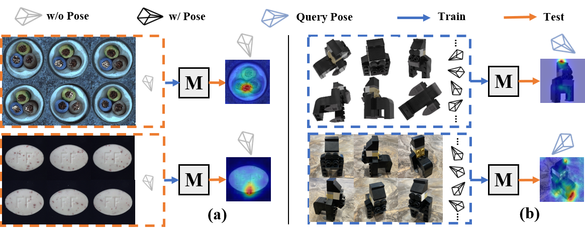
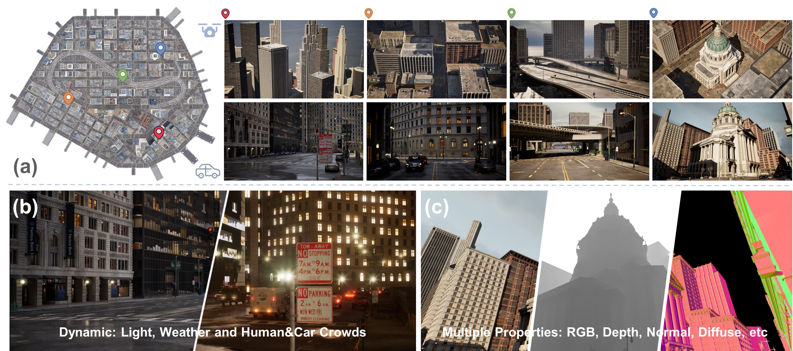








I am currently a first-year Ph.D. student at [USTC](https://www.ustc.edu.cn/) and [Shanghai AI Laboratory](https://www.shlab.org.cn/). I am co-supervised by [Feng Zhao](https://en.auto.ustc.edu.cn/2021/0616/c26828a513169/page.htm), [Bo Dai](https://daibo.info/), and [Dahua Lin](http://dahua.site/). Previously, I obtained my B.Eng. degree at [SGG](http://main.sgg.whu.edu.cn/) of Wuhan University in 2023. 

My research interest lies in the field of 3D Computer Vision, particularly neural rendering for large-scale scenes.

# 🔥 News
- 2023.09: 🎉 one paper got accepted to [NeurIPS 2023 D&B Track](https://nips.cc/Conferences/2023/CallForDatasetsBenchmarks). 
- 2023.07: 🎉 our [LandMark System](https://landmark.intern-ai.org.cn/) was released.
- *2023.07*: 🎉 one paper got accepted to [ICCV 2023](https://iccv2023.thecvf.com/). 
- 2023.06: 🎓 Graduated from Wuhan University.

# 📝 Publications 

(†: corresponding author; * :equal contribution)

NeurIPS 2023 D&B Track 

PAD: A Dataset and Benchmark for Pose-agnostic Anomaly Detection. [[**Project**]](https://github.com/EricLee0224/PAD) [[**Paper**]](https://arxiv.org/pdf/2310.07716.pdf)

Qiang Zhou\*, Weize Li\*, **Lihan Jiang**, Guoliang Wang, Guyue Zhou, Shanghang Zhang, Hao Zhao.

ICCV 2023

MatrixCity: A Large-scale City Dataset for City-scale Neural Rendering and Beyond. [[**Project**]](https://city-super.github.io/matrixcity/) [[**Paper**]](https://arxiv.org/pdf/2309.16553v1.pdf)

Yixuan Li*, **Lihan Jiang\***, Linning Xu, Yuanbo Xiangli, Zhengzhi Wang, Dahua Lin, Bo Dai. 

# 🎖 Honors and Awards
- Outstanding Graduate Student, WHU, 2023
- China National Scholarships, 2021
- China National Scholarships, 2020
- The First Prize Scholarship, WHU, 2021
- The First Prize Scholarship, WHU, 2020

# 📖 Educations
- Ph.D. in Control Science and Engineering of [University of Science and Technology of China](https://www.ustc.edu.cn/), 2023.09 - present
- B.S. in Geodesy and Geomatics Engineering of [Wuhan University](https://www.whu.edu.cn/), 2019.09 - 2023.06
  - GPA: 3.95/4.00, Rank: 1/225

# 💻 Internships
- *2022.05 - 2022.11*, in [AIR, Tsinghua University](https://air.tsinghua.edu.cn/en/)