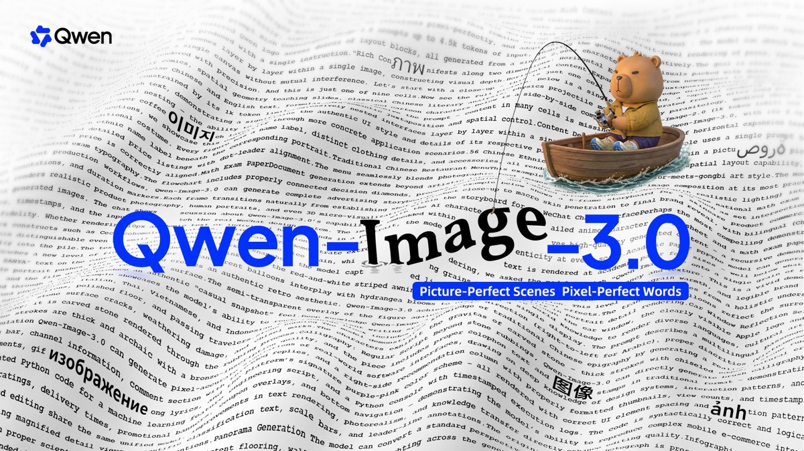
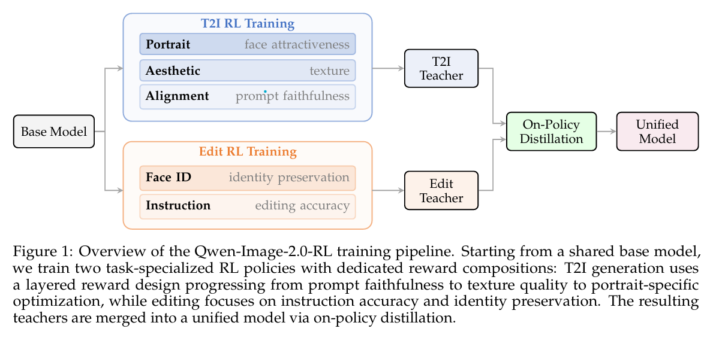
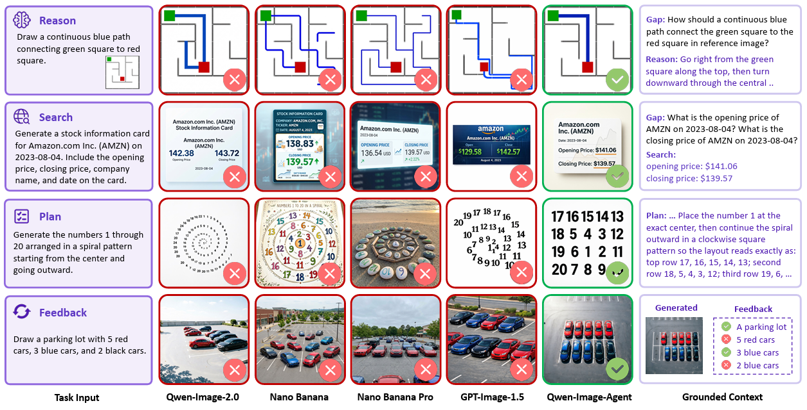
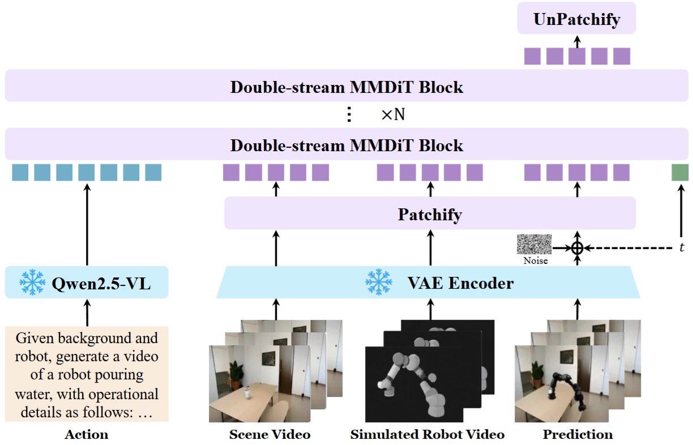
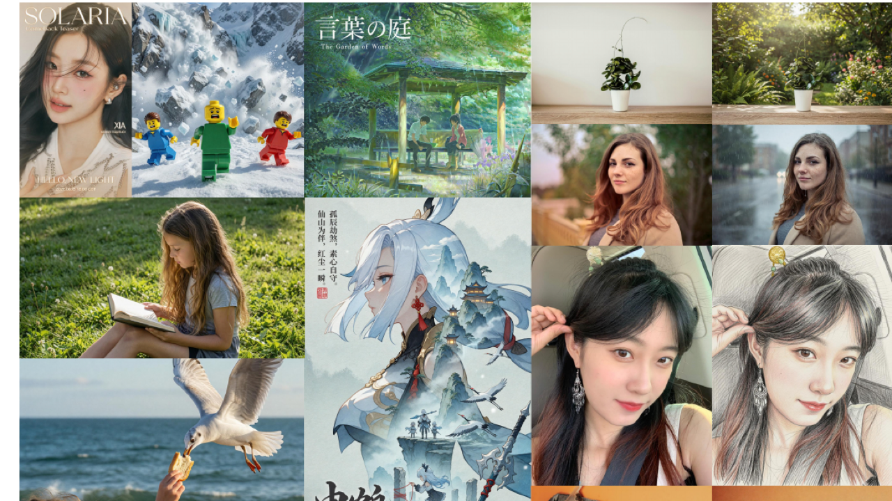
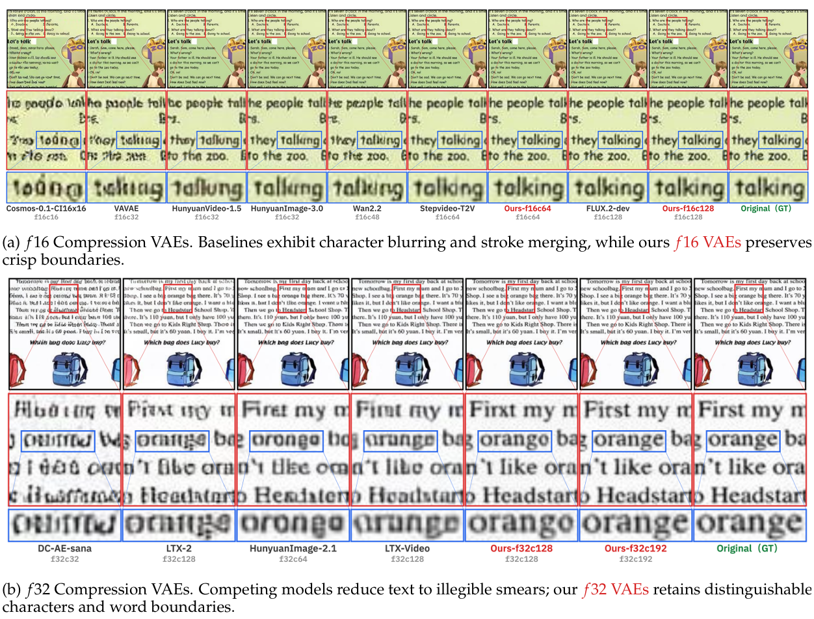
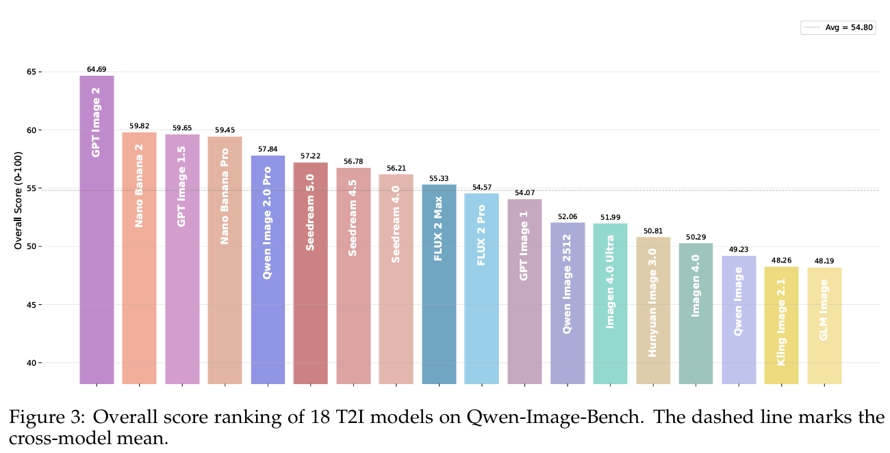








I am a third-year Ph.D. student at [USTC](https://www.ustc.edu.cn/) and a Research Intern at [Qwen, Alibaba Group](https://qwen.ai/). I am co-supervised by [Feng Zhao](https://en.auto.ustc.edu.cn/2021/0616/c26828a513169/page.htm), [Bo Dai](https://daibo.info/), and [Dahua Lin](http://dahua.site/). Previously, I conducted research at [Shanghai AI Laboratory](https://www.shlab.org.cn/) and received my B.Eng. from Wuhan University in 2023.

**Some topics that I currently focus on include:**

- **Controllable image generation and editing:** [Qwen-Image-3.0](https://qwen.ai/blog?id=qwen-image-3.0), [Qwen-Image-2.0](https://arxiv.org/abs/2605.10730)
- **3D reconstruction and scalable neural rendering:** [AnySplat](https://city-super.github.io/anysplat/), [Horizon-GS](https://city-super.github.io/horizon-gs/), [Octree-GS](https://city-super.github.io/octree-gs/), [MatrixCity](https://city-super.github.io/matrixcity/)

# 🔥 News

- **2026.08** &emsp; Two papers were accepted to the main track of [EMNLP 2026](https://2026.emnlp.org/).
- **2026.08** &emsp; We’re excited to celebrate the release of [Qwen-Image-3.0](https://qwen.ai/blog?id=qwen-image-3.0)! Congratulations to the whole team, and I’m delighted to work with so many talented people. Many thanks to [Arena.ai](https://x.com/arena) for featuring Qwen-Image-3.0-Pro at **#5 with 1,263 points** on the Text-to-Image Arena, up from #15 and 1,191 points for Qwen-Image-2.0-Pro. [[**Leaderboard**]](https://arena.ai/leaderboard)
- **2026.05** &emsp; We released the [Qwen-Image-2.0](https://arxiv.org/abs/2605.10730) Technical Report.
- **2026.02** &emsp; One paper was accepted to [CVPR 2026](https://cvpr.thecvf.com/Conferences/2026).
- **2025.09** &emsp; One paper was accepted to [NeurIPS 2025](https://neurips.cc/Conferences/2025/).
- **2025.08** &emsp; One paper was accepted to [SIGGRAPH Asia 2025 (ACM TOG)](https://asia.siggraph.org/2025/).

Earlier news

- **2025.06** &emsp; One paper was accepted to [ICCV 2025](https://iccv.thecvf.com/Conferences/2025).
- **2025.05** &emsp; One paper was accepted to [SIGGRAPH 2025](https://s2025.siggraph.org/).
- **2025.05** &emsp; One paper was accepted to [TPAMI 2025](https://ieeexplore.ieee.org/xpl/RecentIssue.jsp?punumber=34).
- **2025.02** &emsp; Two papers were accepted to [CVPR 2025](https://cvpr.thecvf.com/Conferences/2025).
- **2024.09** &emsp; One paper was accepted to [NeurIPS 2024](https://neurips.cc/Conferences/2024).
- **2023.09** &emsp; One paper was accepted to [NeurIPS 2023 D&B Track](https://nips.cc/Conferences/2023/CallForDatasetsBenchmarks).
- **2023.07** &emsp; Our [LandMark System](https://landmark.intern-ai.org.cn/) was released.
- **2023.07** &emsp; One paper was accepted to [ICCV 2023](https://iccv2023.thecvf.com/).
- **2023.06** &emsp; Graduated from Wuhan University.

# 🔖 Technical Reports

<!-- Qwen-Image-3.0 -->

Technical Report

**Qwen-Image-3.0: Rich Content, Authentic Details, Deep Knowledge**

Qwen Team · **Core Contributor**

Built for useful visual work with prompts up to 4.5K tokens, legible text down to 10 px, native rendering in 12 languages, knowledge-rich generation, and realistic interfaces.

[[**Blog**]](https://qwen.ai/blog?id=qwen-image-3.0)&nbsp;
[[**Try Qwen**]](https://chat.qwen.ai/?inputFeature=t2i)&nbsp;
[[**API**]](https://www.alibabacloud.com/help/en/model-studio/qwen-image-generation-and-editing-api-reference)

<!-- Qwen-Image-3.0 -->

<!-- Qwen-Image-2.0-RL -->

Technical Report

**Qwen-Image-2.0-RL Technical Report**

Qwen Team

A post-training pipeline combining task-specific reward models, GRPO-based reinforcement learning, and on-policy distillation to improve visual quality, instruction following, editing accuracy, and face identity preservation.

[[**Paper**]](https://arxiv.org/abs/2606.27608)

<!-- Qwen-Image-2.0-RL -->

<!-- Qwen-Image-Agent -->

Technical Report

**Qwen-Image-Agent: Bridging the Context Gap in Real-World Image Generation**

Qwen Team

A context-centric image generation agent that plans for missing information and grounds requests through reasoning, search, memory, and feedback, turning underspecified user intent into reliable generation context.

[[**Paper**]](https://arxiv.org/abs/2606.26907)

<!-- Qwen-Image-Agent -->

<!-- Qwen-RobotWorld -->

Technical Report

**Qwen-RobotWorld Technical Report: Unifying Embodied World Modeling through Language-Conditioned Video Generation**

Qwen Team

A language-conditioned video world model that predicts physically grounded future trajectories across robotic manipulation, autonomous driving, indoor navigation, and human-to-robot transfer.

[[**Paper**]](https://arxiv.org/abs/2606.17030)&nbsp;
[[**Blog**]](https://qwen.ai/blog?id=qwen-robotworld)

<!-- Qwen-RobotWorld -->

<!-- Qwen-Image-Flash -->

Technical Report

**Qwen-Image-Flash: Beyond Objective Design**

Qwen Team

A unified 4-NFE model for fast text-to-image generation and instruction-guided editing, developed through a systematic study of data composition, multi-teacher guidance, and generation-editing task mixtures.

[[**Paper**]](https://arxiv.org/abs/2606.03746)

<!-- Qwen-Image-Flash -->

<!-- Qwen-Image-VAE-2.0 -->

Technical Report

**Qwen-Image-VAE-2.0 Technical Report**

Qwen Team

A high-compression VAE suite designed for strong reconstruction fidelity and diffusion-friendly latent representations, with particular gains on text-rich imagery and efficient encoding.

[[**Paper**]](https://arxiv.org/abs/2605.13565)&nbsp;
[[**Benchmark Code**]](https://github.com/alibaba/OmniDoc-TokenBench)&nbsp;

<!-- Qwen-Image-VAE-2.0 -->

<!-- Qwen-Image-2.0 -->

Technical Report

**Qwen-Image-2.0 Technical Report**

Qwen Team · **Core Contributor**

Qwen-Image-2.0 is an omni-capable image generation foundation model that integrates high-fidelity image creation and precise image editing into a single unified framework.

[[**Paper**]](https://arxiv.org/abs/2605.10730)

<!-- Qwen-Image-2.0 -->

# 📝 Research Papers

(† corresponding author; * equal contribution)

<!-- Qwen-Image-Bench -->

EMNLP 2026

**Qwen-Image-Bench: From Generation to Creation in Text-to-Image Evaluation**

Qwen Team

Qwen-Image-Bench is a creator-centric benchmark for evaluating text-to-image models with fine-grained, expert-aligned scoring.

[[**Paper**]](https://arxiv.org/abs/2605.28091)&nbsp;
[[**Code**]](https://github.com/QwenLM/Qwen-Image-Bench)&nbsp;

<!-- Qwen-Image-Bench -->

<!-- G2VLM -->

CVPR 2026

**G²VLM: Geometry Grounded Vision Language Model with Unified 3D Reconstruction and Spatial Reasoning**

[Wenbo Hu](https://gordonhu608.github.io/g2vlm.github.io/)\*,
[Jingli Lin](https://openreview.net/profile?id=~Jingli_Lin1)\*,
[Yilin Long](https://openreview.net/profile?id=~Yilin_Long1)\*,
[Yunlong Ran](https://openreview.net/profile?id=~Yunlong_Ran1),
**Lihan Jiang**,
[Yifan Wang](https://github.com/wangyf2001),
[Chenming Zhu](https://zcmax.github.io/),
[Runsen Xu](https://runsenxu.com/),
[Tai Wang†](https://tai-wang.github.io/),
[Jiangmiao Pang†](https://oceanpang.github.io/)

[[**Project**]](https://gordonhu608.github.io/g2vlm.github.io/)&nbsp;
[[**Paper**]](https://arxiv.org/abs/2511.21688)&nbsp;
[[**Code**]](https://github.com/InternRobotics/G2VLM)&nbsp;

<!-- G2VLM -->

<!-- AnySplat -->

SIGGRAPH Asia 2025 (ACM TOG)

**AnySplat: Feed-forward 3D Gaussian Splatting from Unconstrained Views**

**Lihan Jiang\***,
[Yucheng Mao*](https://myc634.github.io/yuchengmao/),
[Linning Xu](https://eveneveno.github.io/lnxu),
[Tao Lu](https://inspirelt.github.io/),
[Kerui Ren](https://cskrren.github.io/),
Yichen Jin,
[Xudong Xu](https://scholar.google.com.hk/citations?user=D8VMkA8AAAAJ&hl=en),
[Mulin Yu](https://scholar.google.com/citations?user=w0Od3hQAAAAJ),
[Jiangmiao Pang](https://oceanpang.github.io/),
[Feng Zhao](https://scholar.google.co.uk/citations?user=r6CvuOUAAAAJ&hl=en),
[Dahua Lin](http://dahua.site/),
[Bo Dai†](https://daibo.info/)

[[**Project**]](https://city-super.github.io/anysplat/)&nbsp;
[[**Paper**]](https://arxiv.org/pdf/2505.23716)&nbsp;
[[**Code**]](https://github.com/OpenRobotLab/AnySplat)&nbsp;

<!-- AnySplat -->

<!-- MVColight -->

NeurIPS 2025

**MV-CoLight: Efficient Object Compositing with Consistent Lighting and Shadow Generation**

[Kerui Ren](https://cskrren.github.io/),
[Jiayang Bai](https://scholar.google.com/citations?user=VmPQ6akAAAAJ&hl=zh-CN),
[Linning Xu](https://eveneveno.github.io/lnxu),
**Lihan Jiang**,
[Jiangmiao Pang](https://oceanpang.github.io/),
[Mulin Yu†](https://scholar.google.com/citations?user=w0Od3hQAAAAJ),
[Bo Dai†](https://daibo.info/)

[[**Project**]](https://city-super.github.io/mvcolight/)&nbsp;
[[**Paper**]](https://arxiv.org/pdf/2505.21483v1)

<!-- MVColight -->

<!-- ObjectGS -->

ICCV 2025

**ObjectGS: Object-aware Scene Reconstruction and Scene Understanding via Gaussian Splatting**

[Ruijie Zhu](https://ruijiezhu94.github.io/ruijiezhu/),
[Mulin Yu](https://scholar.google.com/citations?user=w0Od3hQAAAAJ),
[Linning Xu](https://eveneveno.github.io/lnxu),
**Lihan Jiang**,
[Yixuan Li](https://yixuanli98.github.io/),
[Tianzhu Zhang](https://staff.ustc.edu.cn/~tzzhang/),
[Jiangmiao Pang](https://oceanpang.github.io/), 
[Bo Dai†](https://daibo.info/), 

[[**Project**]](https://ruijiezhu94.github.io/ObjectGS_page/)&nbsp;
[[**Paper**]](https://arxiv.org/pdf/2507.15454.pdf)&nbsp;
[[**Code**]](https://github.com/RuijieZhu94/ObjectGS)&nbsp;

<!-- ObjectGS -->

<!-- V3DG -->

SIGGRAPH 2025

**Virtualized 3D Gaussians: Flexible Cluster-based Level-of-Detail System for Real-Time Rendering of Composed Scenes**

[Xijie Yang](https://yang-xijie.github.io/),
[Linning Xu](https://eveneveno.github.io/lnxu),
**Lihan Jiang**,
[Dahua Lin](http://dahua.site/), 
[Bo Dai†](https://daibo.info/), 

[[**Project**]](https://xijie-yang.github.io/V3DG/)&nbsp;
[[**Paper**]](https://arxiv.org/pdf/2505.06523)&nbsp;
[[**Code**]](https://github.com/city-super/V3DG)&nbsp;

<!-- V3DG -->

<!-- Scene4U -->

CVPR 2025

**Scene4U: Hierarchical Layered 3D Scene Reconstruction from Single Panoramic Image for Your Immerse Exploration**

[Zilong Huang](https://openreview.net/profile?id=~Zilong_Huang2),
[Jun He](https://scholar.google.com/citations?user=ktFT40UAAAAJ&hl=zh-CN),
[Junyan Ye](https://scholar.google.com/citations?user=6IbGkd4AAAAJ&hl=en), 
**Lihan Jiang**,
[Weijia Li](https://liweijia.github.io/), 
[Yiping Chen](https://scholar.google.com/citations?user=e9lv2fUAAAAJ&hl=en), 
[Ting Han](https://scholar.google.com/citations?user=IVWx-jwAAAAJ&hl=zh-CN)

[[**Paper**]](https://arxiv.org/pdf/2504.00387)

<!-- Scene4U -->

<!-- Horizon-GS -->

CVPR 2025

**Horizon-GS: Unified 3D Gaussian Splatting for Large-Scale Aerial-to-Ground Scenes**

**Lihan Jiang\***,
[Kerui Ren*](https://cskrren.github.io/),
[Mulin Yu](https://scholar.google.com/citations?user=w0Od3hQAAAAJ),
[Linning Xu](https://eveneveno.github.io/lnxu),
[Junting Dong](https://jtdong.com/),
[Tao Lu](https://inspirelt.github.io/),
[Feng Zhao](https://scholar.google.co.uk/citations?user=r6CvuOUAAAAJ&hl=en),
[Dahua Lin](http://dahua.site/),
[Bo Dai†](https://daibo.info/)

[[**Project**]](https://city-super.github.io/horizon-gs/)&nbsp;
[[**Paper**]](https://arxiv.org/pdf/2412.01745)&nbsp;
[[**Code**]](https://github.com/OpenRobotLab/HorizonGS)&nbsp;

<!-- Horizon-GS -->

<!-- Octree-GS -->

TPAMI 2025

**Octree-GS: Towards Consistent Real-time Rendering with LOD-Structured 3D Gaussians**

[Kerui Ren*](https://cskrren.github.io/),
**Lihan Jiang\***,
[Tao Lu](https://inspirelt.github.io/),
[Mulin Yu](https://scholar.google.com/citations?user=w0Od3hQAAAAJ),
[Linning Xu](https://eveneveno.github.io/lnxu),
[Zhangkai Ni](https://eezkni.github.io/),
[Bo Dai†](https://daibo.info/)

[[**Project**]](https://city-super.github.io/octree-gs/)&nbsp;
[[**Paper**]](https://arxiv.org/abs/2403.17898)&nbsp;
[[**Code**]](https://github.com/city-super/Octree-GS)&nbsp;

<!-- Octree-GS -->

<!-- GSDF -->

NeurIPS 2024

**GSDF: 3DGS Meets SDF for Improved Rendering and Reconstruction**

[Mulin Yu\*](https://scholar.google.com/citations?user=w0Od3hQAAAAJ),
[Tao Lu*](https://inspirelt.github.io/),
[Linning Xu](https://eveneveno.github.io/lnxu),
**Lihan Jiang**,
[Yuanbo Xiangli†](https://kam1107.github.io/),
[Bo Dai](https://daibo.info/)

[[**Project**]](https://city-super.github.io/GSDF/)&nbsp;
[[**Paper**]](https://arxiv.org/abs/2403.16964)&nbsp;
[[**Code**]](https://github.com/city-super/GSDF)&nbsp;

<!-- GSDF -->

<!-- PAD -->

NeurIPS 2023 D&B Track 

**PAD: A Dataset and Benchmark for Pose-agnostic Anomaly Detection**

[Qiang Zhou\*](https://scholar.google.com/citations?user=CMYTxUEAAAAJ&hl=en),
[Weize Li\*](https://ericlee0224.github.io/),
**Lihan Jiang**,
[Guoliang Wang](https://github.com/Cross-ZBuild),
[Guyue Zhou](https://air.tsinghua.edu.cn/en/info/1046/1196.htm),
[Shanghang Zhang](https://www.shanghangzhang.com/),
[Hao Zhao†](https://sites.google.com/view/fromandto)

[[**Project**]](https://github.com/EricLee0224/PAD)&nbsp;
[[**Paper**]](https://arxiv.org/pdf/2310.07716.pdf)&nbsp;
[[**Code**]](https://github.com/EricLee0224/PAD)&nbsp;

<!-- PAD -->

<!-- MatrixCity -->

ICCV 2023

**MatrixCity: A Large-scale City Dataset for City-scale Neural Rendering and Beyond** 

[Yixuan Li*](https://yixuanli98.github.io/),
**Lihan Jiang\***,
[Linning Xu](https://eveneveno.github.io/lnxu/),
[Yuanbo Xiangli](https://kam1107.github.io/),
[Zhengzhi Wang](https://zhenzhiwang.github.io/),
[Dahua Lin](http://dahua.me/),
[Bo Dai†](http://daibo.info/)

[[**Project**]](https://city-super.github.io/matrixcity/)&nbsp;
[[**Paper**]](https://arxiv.org/pdf/2309.16553v1.pdf)&nbsp;
[[**Code**]](https://github.com/city-super/MatrixCity)&nbsp;

<!-- MatrixCity -->

# 🎖 Honors and Awards
- Outstanding Graduate Student, WHU, 2023
- China National Scholarships, 2021
- China National Scholarships, 2020
- The First Prize Scholarship, WHU, 2021
- The First Prize Scholarship, WHU, 2020

# 📖 Education
- Ph.D. in Control Science and Engineering, [University of Science and Technology of China](https://www.ustc.edu.cn/), Sep 2023 - Jun 2028 (expected)
- B.Eng. in Geodesy and Geomatics Engineering, [Wuhan University](https://www.whu.edu.cn/), Sep 2019 - Jun 2023
  - GPA: 3.95/4.00, Rank: 1/225

# 🧐 Academic Service

**Reviewer**

- NeurIPS: 2024, 2025
- ICLR: 2025, 2026
- ICML: 2025, 2026
- CVPR: 2025, 2026
- EuroGraphics: 2025
- SIGGRAPH: 2025, 2026
  
# 💻 Research Experience

  

    

      
    

    

      

        <h3 class="internship-title"><a href="https://qwen.ai/">Qwen</a>, Alibaba Group</h3>
        Research Intern
      

      

        <i class="far fa-calendar-alt"></i>Mar 2026 - Present
        <i class="far fa-user"></i>Supervised by <a href="https://chenfei-wu.github.io/">Chenfei Wu</a>
      

    

  

  

    

      
    

    

      

        <h3 class="internship-title"><a href="https://www.shlab.org.cn/">Shanghai AI Laboratory</a></h3>
        Research Intern
      

      

        <i class="far fa-calendar-alt"></i>Dec 2022 - Mar 2026
        <i class="far fa-user"></i>Supervised by <a href="https://daibo.info/">Bo Dai</a>
      

    

  

  

    

      
    

    

      

        <h3 class="internship-title"><a href="https://air.tsinghua.edu.cn/en/">AIR, Tsinghua University</a></h3>
        Research Intern
      

      

        <i class="far fa-calendar-alt"></i>May 2022 - Nov 2022
        <i class="far fa-user"></i>Supervised by <a href="https://sites.google.com/view/fromandto">Hao Zhao</a>
      

    

  

